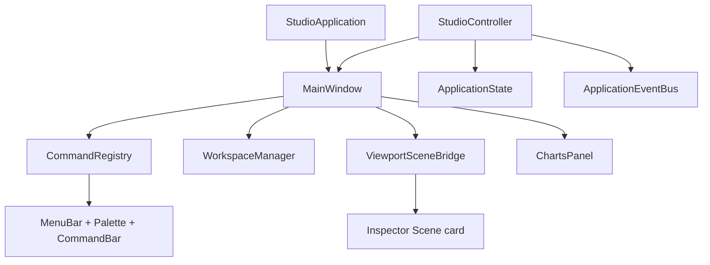

# Motion Studio Platform

Native PySide6 shell for AXYX. See [PHASE_STATUS.md](PHASE_STATUS.md) for what is production-wired vs deferred.

## Live systems

| Module | Role |
|--------|------|
| `studio/commands/` | `CommandRegistry`, menus, shortcuts, command palette |
| `studio/tasks/` | `TaskManager` async dataset loads with progress |
| `studio/components/` | `IconButton`, toast (only what the shell uses) |
| `studio/state/` | Observable project/selection/workspace/viewport/inspector/playback |
| `studio/events/` | Typed bus; MainWindow observes session/dataset/frame/playback/errors |
| `studio/theme/` | Light / dark / high_contrast tokenized QSS |
| `studio/docking/` | `WorkspaceManager` layout + named presets + factory reset |
| `studio/panels/` | Inspector, Charts (pyqtgraph), metadata/metrics |
| `studio/undo/` | Selection undo/redo via `StudioUndoStack` |
| `studio/plugins/` | Entry-point loader + sample plugin; docks register with WorkspaceManager |
| `studio/viewport/scene_bridge.py` | SceneGraph **read model** (skeleton/avatar/ground) feeding Inspector Scene card |
| `studio/settings.py` | Typed schema, migrate v2, validate/clamp |

## Rendering honesty

PyVista draw queues still paint frames. SceneGraph does **not** replace the renderer; it describes session layers for UI consumers.

## Entry

```bash
axyx   # → motion_engine.studio.app:run_studio
```

Optional deps: `pip install axyx[studio]`.


